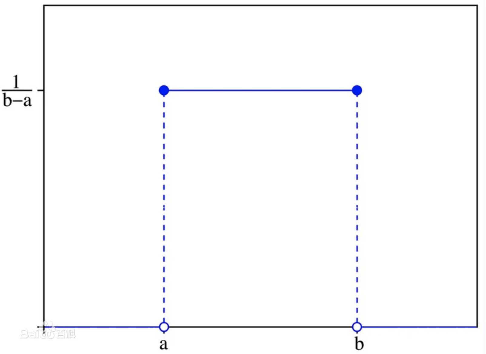
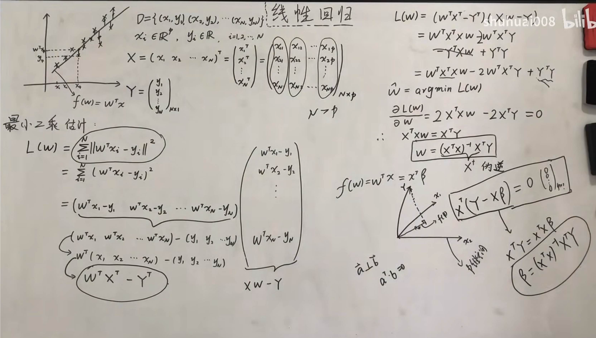
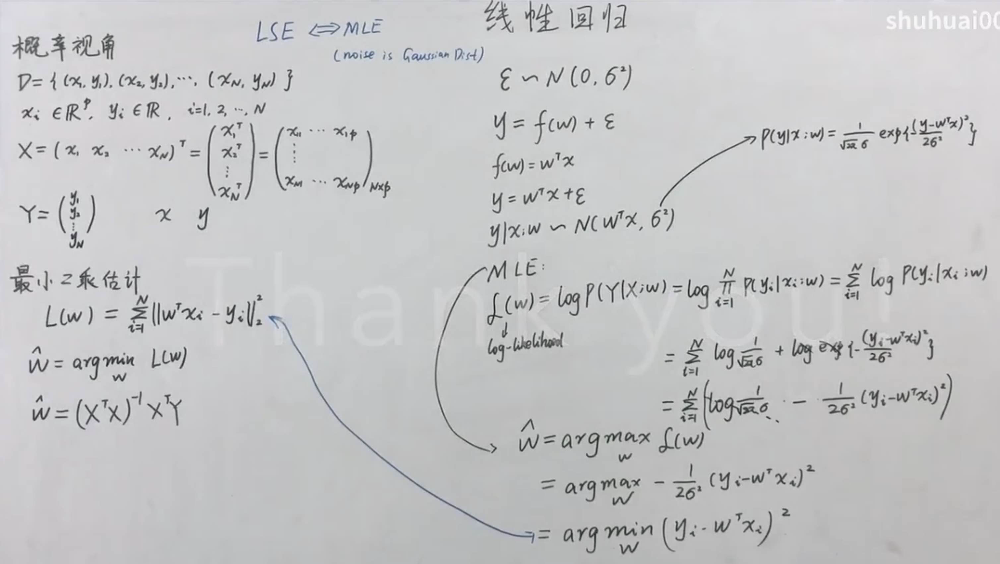
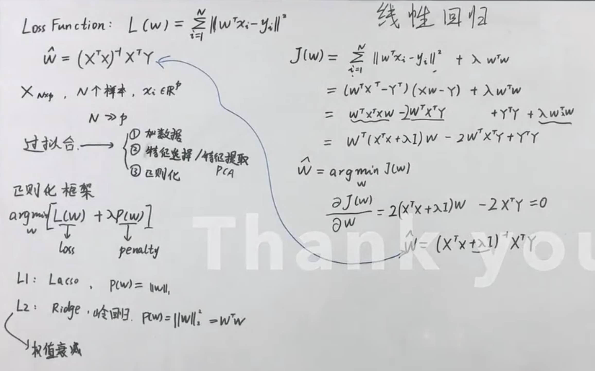
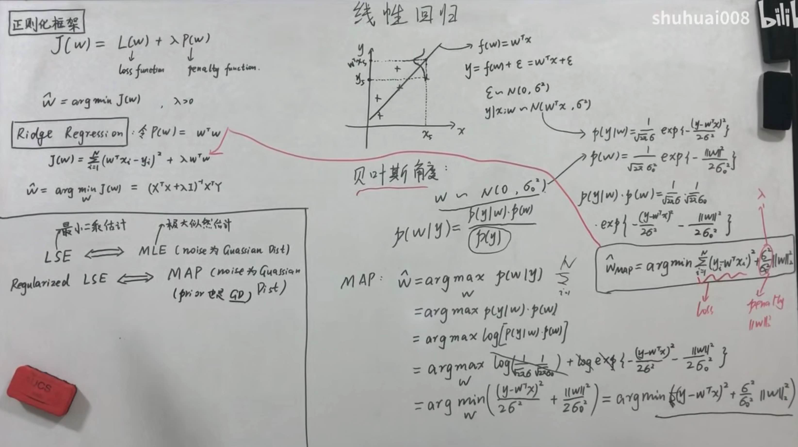

?> 中心极限定理
### 定义
&emsp;&emsp;中心极限定理指的是给定一个任意分布的总体。我每次从这些总体中随机抽取 n 个抽样，一共抽 m 次。 然后把这m组抽样分别求出平均值。 这些平均值的分布接近正态分布。
### 应用
&emsp;&emsp;实际应用在实际生活当中，我们不能知道我们想要研究的对象的平均值，标准差之类的统计参数。中心极限定理在理论上保证了我们可以用只抽样一部分的方法，达到推测研究对象统计参数的目的。掷骰子这一行为的理论平均值3.5是我们通过数学定理计算出来的。而我们在实际模拟中，计算出来的样本平均值的平均值（3.48494）确实已经和理论值非常接近了。
简单地说，连续投掷多次色子，取这几次平均值，会发现比单独一次投掷更加接近平均（3.5）。
请比较一下几种情况：

- 投掷了一次，得到1，概率1/6
- 投掷了两次，平均为1，概率1/36
- 投掷了三次，平均为1，概率1/216

&emsp;&emsp;发现取平均值以后，达到极端值的概率更小，所以即使原始分布为平均，其取样平均值（把几次放在一起算平均值）的结果也会趋向于正态分布。

?> 假设检验

https://www.zhihu.com/question/20254932?sort=created

?> 概率密度函数

&emsp;&emsp;https://www.zhihu.com/question/263467674
### 概念
&emsp;&emsp;在数学中，连续型随机变量的概率密度函数是一个描述这个随机变量的输出值，在某个确定的取值点附近的可能性的函数。而随机变量的取值落在某个区域之内的概率则为概率密度函数在这个区域上的积分。当概率密度函数存在的时候，累积分布函数是概率密度函数的积分。概率密度函数一般以小写标记。

### 定义
&emsp;&emsp;对于一维实随机变量 $X$, 设它的累积分布函数是 $F_{X}(x)$, 如果存在可测函数 $f_{X}(x)$, 满 足: $F_{X}(x)=\int_{-\infty}^{x} f_{X}(t) d t$, 那么 $X$ 是一个连续型随机变量, 并且 $f_{X}(x)$ 是它的概率密度函数。

### 性质
 - $f(x) \geq 0$
 - $\int_{-\infty}^{+\infty} f(x) d x=1$
 - $P(a<x \leq b)=\int_{a}^{b} f(x) d x$

### 举例
&emsp;&emsp;最简单的概率密度函数是均匀分布的密度函数。对于一个取值在区间 $[a, b]$ 上的均匀分 布函数 $I_{[a, b]}$ ，它的概率密度函数： $f_{I_{[a, b]}}(x)=\frac{1}{b-a} I_{[a, b]}$
也就是说, 当 $x$ 不在区间 $[a, b]$ 上的时候, 函数值等于 0 ; 而在区间 $[a, b]$ 上的时候, 函数 值等于这个函数 $\frac{1}{b-a}$ 。这个函数并不是完全的连续函数, 但是是可积函数。



&emsp;&emsp;正态分布是重要的概率分布。随着参数 $\mu$ 和 $\sigma$ 变化，概率分布也产生变化。它的概率密度函数是:
$$
f(x)=\frac{1}{\sigma \sqrt{2 \pi}} e^{-\frac{(x-\mu)^{2}}{2 \sigma^{2}}}
$$

&emsp;&emsp;对概率密度函数作傅里叶变换可得特征函数。特征函数与概率密度函数有一对一的关系。因此知道一个分布的特征函数就等同于知道一个分布的概率密度函数:
$$
\varnothing_{x}(j w)=\int_{-\infty}^{+\infty} f(x) e^{j w x} d x
$$


&emsp;&emsp;概率密度并不直接表示概率，就是概率密度只是表示概率的分布程度，就像一个小球1kg ，有一小块密度大，有一小块密度小，这一块的密度只是表示这里材料的密集度，并不表示质量。概率密度没有范围就想小球某一块的密度大小没有范围一样。就像某一块的密度可以很大，那其他块的密度就很小，但是总质量还是那么多。


?> 最大期望算法（EM）

&emsp;&emsp;https://zhuanlan.zhihu.com/p/85236423

### 概念
&emsp;&emsp;是一种迭代算法，用于含有隐变量的概率模型参数的极大似然估计（或最大后验概率估计）

&emsp;&emsp;通常，当模型的变量都是观测变量时，可以直接通过极大似然估计法，或者贝叶斯估计法估计模型参数。但是当模型包含隐变量时，就不能简单的使用这些估计方法。


?> 极大似然估计

&emsp;&emsp;https://zhuanlan.zhihu.com/p/32480810

### 理解
&emsp;&emsp;利用已知的样本结果，反推最有可能（最大概率）导致这样结果的参数值。

$$\widehat{\theta}_{M L E}=\arg \max _{\theta} P(D \mid \theta)$$

### 举例
&emsp;&emsp;例如：一个麻袋里有白球与黑球，但是我不知道它们之间的比例，那我就有放回的抽取10次，结果我发现我抽到了8次黑球2次白球，我要求最有可能的黑白球之间的比例时，就采取最大似然估计法：
 我假设我抽到黑球的概率为p,那得出8次黑球2次白球这个结果的概率为：P(黑=8)=p^8*（1-p）^2,现在我想要得出p是多少啊，很简单，使得P(黑=8)最大的p就是我要求的结果，接下来求导的的过程就是求极值的过程啦。可能你会有疑问，为什么要ln一下呢，这是因为ln把乘法变成加法了，且不会改变极值的位置（单调性保持一致嘛）这样求导会方便很多~同样，这样一道题：设总体X 的概率密度为 已知 X1,X2..Xn是样本观测值，求θ的极大似然估计这也一样啊，要得到 X1,X2..Xn这样一组样本观测值的概率是P{x1=X1,x2=X2,...xn=Xn}=
f(X1,θ)f(X2,θ)…f(Xn,θ)  然后我们就求使得P最大的θ就好啦，一样是求极值的过程，不再赘述。

&emsp;&emsp;假设我们的抽样是理想正确的；
概率大的事件在一次观测中更容易发生（打猎问题）；
在一次观测中发生了的事件其概率应该大（身高问题）。

### 步骤：
- 1.已知某分布的概率密度函数
- 2.计算其似然函数
- 3.似然函数取对数
- 4.求最值对应的参数
- 5.得到估计的参数


?> 最大后验概率(MAP)

&emsp;&emsp;https://zhuanlan.zhihu.com/p/32480810

&emsp;&emsp;在贝叶斯统计学中，“最大后验概率估计”是后验概率分布的众数。利用最大后验概率估计可以获得对实验数据中无法直接观察到的量的点估计。它与最大似然估计中的经典方法有密切关系，但是它使用了一个增广的优化目标，进一步考虑了被估计量的先验概率分布。所以最大后验概率估计可以看作是规则化（regularization）的最大似然估计。

$$\begin{aligned} \hat{\theta}_{M A P} &=\arg \max _{\theta} P(\theta \mid D) \\ &=\arg \max _{\theta} P(D \mid \theta) P(\theta) \end{aligned}$$

&emsp;&emsp;(1) 频率学派: 存在唯一真值 $\theta$ 。举一个简单直观的例子-抛硬币, 我们用 $P(h e a d)$ 来表示硬币 的bias。抛一枚硬币100次, 有20次正面朝上, 要估计抛硬币正面朝上的bias $P(h e a d)=\theta$ 。在 频率学派来看, $\theta=20 / 100=0.2$, 很直观。当数据量趋于无穷时, 这种方法能给出精准的估 计; 然而缺乏数据时则可能产生严重的偏差。例如, 对于一枚均匀硬币, 即 $\theta=0.5$, 抛郑 次, 出现5次正面 (这种情况出现的概率是 $1 / 2^{\wedge} 5=3.125 \%$ ), 频率学派会直接估计这枚硬币 $\theta=1$, 出现 严重错误。

&emsp;&emsp;(2) 贝叶斯学派: $\theta$ 是一个随机变量, 符合一定的概率分布。在贝叶斯学派里有两大输入和一大输 出, 输入是先验 (prior)和似然 (likelihood), 输出是后验 (posterior)。先验, 即 $P(\theta)$, 指的是在 没有观测到任何数据时对 $\theta$ 的预先判断, 例如给我一个硬币, 一种可行的先验是认为这个硬币有 很大的概率是均匀的, 有较小的概率是是不均匀的; 似然, 即 $P(X \mid \theta)$, 是假设 $\theta$ 已知后我们观 察到的数据应该是什么样子的; 后验, 即 $P(\theta \mid X)$, 是最终的参数分布。

?> 线性回归


### 最小二乘法及几何意义



### 最小二乘法概率角度为高斯噪声的MLE



### 正则化 L2岭回归 频率角度


- 图中N>>p表示正常情况，非正常情况 N<<p 就会造成过拟合
- 相比不带正则化项的线性回归的损失函数，带正则的损失函数多了$\lambda I$的对角矩阵
- $X^{\top} X$是半正定矩阵，加上对角矩阵一定是正定的，所以一定可逆

### 正则化 L2岭回归 贝叶斯角度


- 不带正则的最小二乘估计等价于频率角度的噪声为高斯分布的极大似然估计
- 带正则项的最小二乘估计等价于贝叶斯角度的先验和噪声都为高斯分布的最大后验概率估计

?>贝叶斯平滑

[基本概念](https://blog.csdn.net/jinping_shi/article/details/78334362)

[简要步骤](https://blog.csdn.net/Elaine_DWL/article/details/97525596?spm=1001.2101.3001.6650.9&utm_medium=distribute.pc_relevant.none-task-blog-2%7Edefault%7EBlogCommendFromBaidu%7ERate-9.pc_relevant_default&depth_1-utm_source=distribute.pc_relevant.none-task-blog-2%7Edefault%7EBlogCommendFromBaidu%7ERate-9.pc_relevant_default&utm_relevant_index=15)

?>威尔逊区间平滑（Wilson CTR）

CTR（Click-Through-Rate）即点击通过率，指广告的点击到达率。CTR是广告推荐系统中一项重要的衡量算法好坏的指标。

计算公式： CTR = 点击数 / 曝光数

由于原始CTR计算方式只考虑了相对值，没有考虑绝对值。即，没有考虑曝光的数值大小，在曝光少的情况下，计算出的CTR其实不可靠，样本充足的情况下，才能反应真实情况。

举个例子，有三个广告：

A：点击数 5 曝光数 10

B：点击数 50 曝光数 100

C：点击数 500 曝光数 1000

此三个广告的CTR 都是 0.5 ，但是按照实际表现，从置信的角度分析，应该是C > B > A，因为C的样本数更多，可信度更高。

为了衡量样本数对于 CTR 置信区间的影响，科学家们引入"威尔逊（Wilson）区间"的概念。公式如下：

$\frac{\hat{p}+\frac{z^{2}}{2 n}}{1+\frac{z^{2}}{n}} \pm \frac{z}{1+\frac{z^{2}}{n}} \sqrt{\frac{\hat{p}(1-\hat{p})}{n}+\frac{z^{2}}{4 n^{2}}}$

根据实际情况取区间上下界

p —— 概率，即点击的概率，也就是 CTR；

n —— 样本总数，即曝光数；

z —— 在正态分布里， $\mu+z \times \sigma$ 会有一定的置信度。例如 z=1.96 ，就有 95% 的置信度,可查表看对应置信度。
Wilson区间的含义就是，就是指在一定置信度下，真实的 CTR 范围是多少。Wilson CTR修正的源码如下：
```python
import numpy as np

def walson_ctr(num_click, num_pv, z=1.96):
    p = num_click * 1.0 / num_pv
    n = num_pv
    
    A = p + z**2 / (2*n)
    B = np.sqrt(p * (1-p) / n + z**2 / (4*(n**2)))
    C = z * B
    D = 1 + z**2 / n

    ctr = (A - C) / D #取了区间下界
    return ctr
```

在电单车场景中，定义[车站效率=订单数量/车辆等待时长]反应车站好坏，此时有三个车站场景:

A：订单数 1 等待时长 0.1h

B：订单数 10 等待时长 1h

C：订单数 100 等待时长 10h

此时三个车站ABC效率都是10,但是按照实际表现，从置信的角度分析，应该是C > B > A，因为C的样本数更多，可信度更高。

因此，可将上述方法推广至此场景，由于wilson平滑的是概率，所以将车站效率拆分成

车站效率=(订单数量/等待车辆数)*(等待车辆数/车辆等待时长),我们对前一项括号中内容进行修正

?>朴素贝叶斯

https://zhuanlan.zhihu.com/p/164619896